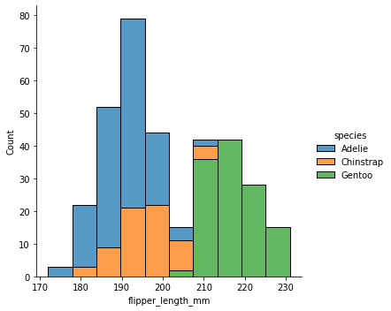

```python
# Google Colaboratory 에서 코드를 실행할 경우 아래 코드를 실행하여 최신 버전의 matplotlib을 설치해주어야 합니다.
# !pip install -U matplotlib
# !pip install seaborn
```

# Seaborn 둘러보기

아마 Seaborn으로 하는 대부분의 작업은 그래프 그리는 함수(plotting functions)들과 관련이 있을겁니다. 이번 장에서는 여러 종류의 시각화 함수 소개 등 개괄적인 이야기들을 해보겠습니다.


```python
import seaborn as sns
```

### 데이터 가져오기
데이터 출처: https://github.com/allisonhorst/palmerpenguins


```python
penguins = sns.load_dataset('penguins')
```


```python
# 판다스 DataFrame
type(penguins)
```


    pandas.core.frame.DataFrame


```python
penguins.head(2)
```


<div>
<style scoped>
    .dataframe tbody tr th:only-of-type {
        vertical-align: middle;
    }

    .dataframe tbody tr th {
        vertical-align: top;
    }

    .dataframe thead th {
        text-align: right;
    }
</style>
<table border="1" class="dataframe">
  <thead>
    <tr style="text-align: right;">
      <th></th>
      <th>species</th>
      <th>island</th>
      <th>bill_length_mm</th>
      <th>bill_depth_mm</th>
      <th>flipper_length_mm</th>
      <th>body_mass_g</th>
      <th>sex</th>
    </tr>
  </thead>
  <tbody>
    <tr>
      <th>0</th>
      <td>Adelie</td>
      <td>Torgersen</td>
      <td>39.1</td>
      <td>18.7</td>
      <td>181.0</td>
      <td>3750.0</td>
      <td>Male</td>
    </tr>
    <tr>
      <th>1</th>
      <td>Adelie</td>
      <td>Torgersen</td>
      <td>39.5</td>
      <td>17.4</td>
      <td>186.0</td>
      <td>3800.0</td>
      <td>Female</td>
    </tr>
  </tbody>
</table>
</div>


# 비슷한 일에는 비슷한 함수를

사용자가 Seaborn의 내부 구조를 모르더라도 편리하게 사용할 수 있도록, Seaborn의 모든 함수는 최상위 레벨에서 접근 가능합니다.

그러나 Seaborn 코드 내부는 비슷한 시각화를 하는 함수들끼리 계층적으로 구조화 되어있습니다. Seaborn의 문서를 읽으면서 `relational`, `distributional`, `categorical` 같은 단어들을 만나게 될겁니다. 이건 Seaborn 내부의 모듈 구조와 밀접한 연관이 있습니다.


```python
# 역자주: Seaborn의 모든 함수는 최상위 레벨에서 접근 가능합니다.
print(dir(sns))
```

    ['FacetGrid', 'JointGrid', 'PairGrid', '__builtins__', '__cached__', '__doc__', '__file__', '__loader__', '__name__', '__package__', '__path__', '__spec__', '__version__', '_core', '_decorators', '_docstrings', '_orig_rc_params', '_statistics', 'algorithms', 'axes_style', 'axisgrid', 'barplot', 'blend_palette', 'boxenplot', 'boxplot', 'categorical', 'catplot', 'choose_colorbrewer_palette', 'choose_cubehelix_palette', 'choose_dark_palette', 'choose_diverging_palette', 'choose_light_palette', 'clustermap', 'cm', 'color_palette', 'colors', 'countplot', 'crayon_palette', 'crayons', 'cubehelix_palette', 'dark_palette', 'desaturate', 'despine', 'displot', 'distplot', 'distributions', 'diverging_palette', 'dogplot', 'ecdfplot', 'external', 'factorplot', 'get_data_home', 'get_dataset_names', 'heatmap', 'histplot', 'hls_palette', 'husl_palette', 'jointplot', 'kdeplot', 'light_palette', 'lineplot', 'lmplot', 'load_dataset', 'matrix', 'miscplot', 'move_legend', 'mpl', 'mpl_palette', 'pairplot', 'palettes', 'palplot', 'plotting_context', 'pointplot', 'rcmod', 'regplot', 'regression', 'relational', 'relplot', 'reset_defaults', 'reset_orig', 'residplot', 'rugplot', 'saturate', 'scatterplot', 'set', 'set_color_codes', 'set_context', 'set_hls_values', 'set_palette', 'set_style', 'set_theme', 'stripplot', 'swarmplot', 'utils', 'violinplot', 'widgets', 'xkcd_palette', 'xkcd_rgb']


예를 들어, `distributions module`은 데이터의 분포를 시각화하는 함수들을 정의합니다. 이 모듈은 히스토그램과 같은 분포 그래프를 그리는 함수들을 포함합니다.


```python
sns.histplot(data=penguins, x='flipper_length_mm', hue='species', multiple='stack')
```


    <AxesSubplot:xlabel='flipper_length_mm', ylabel='Count'>


    

    


분포를 그리는 다른 함수인 `kdeplot()`도 히스토그램과 같이 `distributions module` 안에 구현되어 있습니다.


```python
sns.kdeplot(data=penguins, x='flipper_length_mm', hue='species', multiple='stack')
```


    <AxesSubplot:xlabel='flipper_length_mm', ylabel='Density'>


    

    


한 모듈 안에 있는 함수들은 많은 내부 코드를 공유하며 비슷한 기능을 제공합니다. 예를 들면 위의 multiple="stack" 같은 매개변수처럼요. 위의 예시에서 histplot()과 kdeplot()은 둘 다 데이터의 분포를 보여주지만, 시각화 방법만 약간 다릅니다. 이렇게 비슷한 시각화 방법들을 한 모듈에 묶어 공통된 기능을 제공함으로써, 사용자가 시각화 방법 간의 장단점을 쉽게 비교하고 자유롭게 변경할 수 있도록 합니다. (역자주. 함수 안의 인자들은 그대로 두고, 함수 명만 `histplot()`에서 `kdeplot()`으로 수정하여 시각화 방법을 바꿀 수 있습니다)

# Figure-level vs. axes-level functions


Seaborn에서는 시각화 함수를 크게 두 가지로 분류합니다. 

* `axes-level` 함수
* `figure-level` 함수

앞에서 보여드렸던 예시들은 모두 `axes-level` 함수였습니다. 이 함수들은 모두 하나의 matplotlib.pyplot.Axes 객체에 데이터를 그립니다.

반대로, `figure-level` 함수들은 `FacetGrid`라는 seaborn 객체를 이용합니다. `relational`, `distributions`, `categorial` 각각의 모듈은 `figure-level` 함수를 하나씩 가지고 있고, 그 함수들은 다양한 `axes-level` 함수들을 포괄할 수 있는 인터페이스를 제공합니다. 구조는 아래와 같습니다. 자세한 것은 예시를 보면서 이야기 합시다.

<div>

</div>

예를 들어, `displot()`은 `distributions` 모듈의 `figure-level` 함수입니다. 추가적인 설정을 하지 않으면 디폴트로 histplot()과 같이 동작합니다.


```python
sns.displot(data=penguins, x='flipper_length_mm', hue='species', multiple='stack')
```


    <seaborn.axisgrid.FacetGrid at 0x7fe45e54ba10>


    

    


같은 데이터를 가지고 kernel density 그래프로 모양만 바꾸고 싶다면, `displot()`의 `kind` 파라미터를 사용하면 됩니다.


```python
sns.displot(data=penguins, x='flipper_length_mm', hue='species', multiple='stack', kind='kde')
```


    <seaborn.axisgrid.FacetGrid at 0x7fe45c50bfd0>


    

    


`axes-level` 그래프와 `figure-level` 그래프, 둘 사이에는 몇 가지 차이점이 있는데요. 가장 눈에 띄는 것은 범례(legend)의 위치입니다. `figure-level` 그래프의 경우 범례가 그래프의 바깥에 위치하고, `axes-level` 그래프는 범례가 그래프 안쪽에 위치합니다.

`figure-level` 함수가 제공하는 가장 유용한 기능은 서브플롯(subplots)을 쉽게 그릴 수 있다는 것입니다. 예를 들어, 세 개의 서로 다른 분포를 하나의 축에 그리는 것이 아니라 각각의 종을 따로 그릴 수 있습니다.


```python
sns.displot(data=penguins, x='flipper_length_mm', hue='species', col='species')
```


    <seaborn.axisgrid.FacetGrid at 0x7fe45c3e1690>


    

    


`figure-level` 함수들은 하위의 `axes-level` 단위의 그래프를 통합하여 관리하며, 그래프 종류에 따라 필요한 인자들(kind-specific keyword arguments; 예를 들면 히스토그램의 계급 간격)을 받아 하위 메소드들에 전달합니다. 

이 과정에서 단점이 하나 있습니다. `axes-level` 단위의 그래프 종류(히스토그램 등)에 따라 필요한 매개 변수들을 `figure-level` 함수의 독스트링([docstring](https://en.wikipedia.org/wiki/Docstring); 함수의 기능이나 매개변수를 설명하는 주석)에서 설명해주지 않는다는 건데요. 따라서 `figure-level` 함수를 사용하면서 하위의 `axes-level` 함수들이 어떤 인자들을 필요로 하는지 따로 문서를 찾아봐야 할 때도 있을겁니다.

# Axes-level functions make self-contained plots

Seaborn의 `axes-level` 함수를 이용하면 matplotlib 보다 쉽게 그래프를 그릴 수 있으며, matplotlib의 figure 안에 이 `axes-level` 함수들을 포함시킬수도 있습니다.

`axes-level` 함수들은 내부적으로 `matplotlib.pyplot.gca()` 메소드를 호출하며, 이는 현재 활성화된 axes에 그래프를 그릴 수 있도록 합니다. 또 다른 방법으로, `axes-level` 함수들은 `ax=` 인자를 받아 어떤 위치에 어떤 플롯을 넣을 것인지 정확히 지정할수도 있습니다.[^1]


```python
import matplotlib.pyplot as plt
```


```python
f, axs = plt.subplots(1, 2, figsize=(8, 4))

# 역자주. ax= 인자를 받아 seaborn의 axes-level 그래프가 matplotlib.pyplot figure안의 어떤 서브플롯에 위치할 것인지 지정합니다.
sns.scatterplot(data=penguins, x="flipper_length_mm", y="bill_length_mm", hue="species", ax=axs[0])
sns.histplot(data=penguins, x="species", hue="species", legend=False, ax=axs[1])

f.tight_layout()
```


    

    


# Figure-level functions own their figure

현재 있는 axes에 그래프를 그리는 것처럼 유연한 동작을 수행하는 `axes-level` 함수와는 다르게 `figure-level` 함수는 다른 그래프와 합쳐서 사용할 수 없습니다.

`figure-level` 함수 내부의 matplotlib axes 에 접근하여 figure 안에 그려진 그래프를 조작하는 것은 가능합니다.


```python
tips = sns.load_dataset("tips")
g = sns.relplot(data=tips, x="total_bill", y="tip")

# type(g.ax): matplotlib.axes._subplots.AxesSubplot
# g 라는 figure 안에 있는 matplotlib AxesSubplot 객체에 접근할 수 있음
g.ax.axline(xy1=(10, 2), slope=.2, color="b", dashes=(5, 2))
```


    <matplotlib.lines._AxLine at 0x7fe45c24f450>


    

    


# figure-level function의 기능

`figure-level` 함수는 FacetGrid 인스턴스를 만듭니다. 이 인스턴스는 그래프를 커스텀할 수 있는 몇 가지 유용한 기능을 제공합니다. 예를 들어, 서브플롯의 축 이름을 단 한 줄의 코드로 설정할 수 있습니다.


```python
g = sns.relplot(data=penguins, x="flipper_length_mm", y="bill_length_mm", col="sex")

# set_axis_labels() 함수로 서브플롯의 축 이름 설정
g.set_axis_labels("Flipper length (mm)", "Bill length (mm)")
```


    <seaborn.axisgrid.FacetGrid at 0x7fe459b1a290>


    

    


이 기능들은 matplotlib API가 아니고 seaborn의 `figure-level` 함수에서만 사용할 수 있는 기능입니다.[^2]

# Specifying figure sizes

matplotlib에서 그래프의 사이즈를 조정하는데는 크게 세 가지 방법이 있습니다.

1. 글로벌 변수인 rcParams을 조정하는 방법
2. `matplotlib.pyplot.subplots()`로 그래프를 만들 때 `figsize` 인자를 이용하는 방법
3. `matplotlib.Figure.set_size_inches()` 메소드를 이용하는 방법

세가지 방법 모두 그래프 전체(entire figure)의 가로폭과 세로폭을 지정해줘야 합니다. seaborn의 `axes-level` 함수도 마찬가지로 그래프 전체의 사이즈를 조정줘야 합니다.


```python
# (역자주) axes-level 함수의 크기를 조정하고 싶을 때에는 주로 아래와 같이 matplotlib.pyplot을 함께 사용합니다.
fig, ax = plt.subplots(figsize=(5, 4))
sns.histplot(data=penguins, x="species", hue="species", ax=ax)
```


    <AxesSubplot:xlabel='species', ylabel='Count'>


    

    


`figure-level` 함수는 약간 다릅니다.

1. 첫 번째로, 함수가 그래프 사이즈를 조절할 수 있는 매개변수를 가지고 있습니다.

2. 두 번째로, seaborn에서 그래프 사이즈를 조절하는 매개변수 height와 aspect는 matplotlib의 그래프 사이즈 조절 매개변수인 width, height와 약간 다르게 동작합니다.[^3]

3. 마지막으로, matplotlib이 그래프 전체(figure)단위로 사이즈를 조절하는 것과 다르게, seaborn의 height, aspect와 같이 사이즈를 조절하는 매개변수는 서브플롯 단위의 사이즈를 조절합니다. 

차이점을 설명하기 위해 `matplotlib.pyplot.subplot()`으로 빈 그래프를 그려보겠습니다.


```python
f, ax = plt.subplots()
```


    

    


컬럼이 여러개인 그래프를 그리면 전체 사이즈에는 변화가 없고 각 서브플롯의 가로폭이 줄어듭니다.


```python
f, ax = plt.subplots(1, 2)
```


    

    


Seaborn의 `figure-level` 함수는 이와 다르게 동작합니다. 차이점을 설명하기 위해서 `FacetGrid`를 이용하여 빈 공간을 그려봅시다. `relplot()`, `displot()`, `catplot()` 같이 `figure-level` 함수를 호출할 때에도 내부에서는 이렇게 빈 공간을 그리는 FacetGrid가 실행됩니다.


```python
g = sns.FacetGrid(penguins)
```


    

    


컬럼이 2개인 그래프를 만들어 봅시다. 전체 사이즈가 유지되었던 matplotlib 과는 다르게, 서브플롯의 가로폭이 유지되고 그래프 전체의 가로폭은 넓어지는 것을 볼 수 있습니다.


```python
g = sns.FacetGrid(penguins, col='sex')
```


    

    


그래프의 사이즈는 이렇게 조정할 수 있습니다.


```python
g = sns.FacetGrid(penguins, col='sex', height=3.5, aspect=.75)
```


    

    


# figure-level functions 의 장단점

위에서 얘기했던 `figure-level` 함수의 장단점을 요약해보겠습니다.

|장점|단점|
|:--:|:-:|
|데이터 변수를 가지고 쉽게 그래프를 만들 수 있음|하위에 포함될 수 있는 `axes-level` 함수 매개변수 설명이 부족함|
|범례가 그래프 바깥에 있음|matplotlib figure에 포함될 수 없음|
|`figure-level` 단위의 조작을 쉽게 할 수 있음|matplotlib API를 사용하지 않음|
|그래프 사이즈 조작 방법이 matplotlib과 다름|그래프 사이즈 조작 방법이 matplotlib과 다름|

앞으로 [seaborn의 튜토리얼](https://seaborn.pydata.org/tutorial/function_overview.html)에서는 `figure-level` 함수를 이용할겁니다. 그리고 여러분들에게도 `figure-level` 함수를 적극 이용할 것을 권장합니다.

만약에 서브플롯이 많은, 복잡한 그래프를 그려야 한다면 matplotlib으로 그래프의 아웃라인을 구성하고 그 안을 seaborn의 `axes-level` 함수를 이용해 채워넣는 방법을 추천합니다.[^4]

# Combining multiple views on the data

위에서 언급한 방식에는 포함되지 않지만, 중요한 시각화 함수 2개를 더 얘기해보겠습니다. `jointplot()`와 `pairplot()`입니다. 두 함수 모두 개념적으로는 `figure-level` 함수이고, 여러 서브플롯으로 구성되었지만 `FacetGrid` 객체가 아니라 각각 `JointGrid`, `PairGrid` 객체를 생성합니다.

`jointplot()`은 두 변수의 결합 분포를 보여줍니다.


```python
sns.jointplot(data=penguins, x='flipper_length_mm', y='bill_length_mm', hue='species')
```


    <seaborn.axisgrid.JointGrid at 0x7fe45968ec90>


    

    


`pairplot()` 도 비슷합니다. `jointplot()`은 지정한 두 변수(x, y)의 관계를 보여주는데, `pairplot()`은 데이터셋에 있는 모든 변수의 조합에 대해 볼 수 있다는 점이 다릅니다.


```python
sns.pairplot(data=penguins, hue='species')
```


    <seaborn.axisgrid.PairGrid at 0x7fe4594df350>


    

    


내부에서 `axes-level` 함수가 동작하기 때문에 `jointplot()`, `pairplot()`에서도 kind 매개변수를 사용해 시각화 방법을 선택할 수 있습니다.

---

[^1]: (역자주) axes를 따로 지정해주지 않았을 때 암묵적으로 현재 axes에 그래프를 그리는 방식과 axes를 정확하게 지정하는 방식, 두 가지를 모두 허용하는 것은 matplotlib의 동작 방식과 매우 유사합니다. matplotlib 공식 튜토리얼 [matplotlib usage guide](https://matplotlib.org/stable/tutorials/introductory/usage.html#sphx-glr-tutorials-introductory-usage-py)를 참고해주세요.

[^2]: (역자주) 이런 함수들을 잘 기억해놨다가 쓸 수 있다면 편리하지만, matplotlib API가 아니라 seaborn의 FacetGrid가 독자적으로 제공하는 기능이기 때문에 구글에 검색하거나 문서에서 찾아서 쓰기 불편한 부분이 있는 것 같습니다.

[^3]: (역자주) matplotlib의 width(그래프의 가로폭) 매개변수는 seaborn에서 height X aspect로 계산할 수 있습니다. matplotlib은 그래프의 가로폭과 세로폭을 숫자로 지정해주는 방식이고, seaborn은 그래프의 세로폭(height)를 먼저 정의하고 그래프의 가로폭은 세로폭과의 상대적인 길이로 정의하는 방식을 채택했습니다.

[^4]: (역자주) Axes-level functions make self-contained plots 파트 코드 예시 참고
